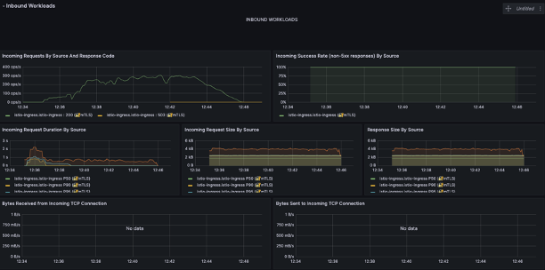

# Project Findings - [Shuo Wang]

- [Project Findings - [Shuo Wang]](#Project-findings---Shuo Wang)
  - [Introduction](#introduction)
  - [Grafana](#Grafana)
  - [Terminal-Running-Record](#Terminal-Running-Record)

---

## Introduction

Case: CACHE_RATE = 0.95

## Grafana

## Terminal-Running-Record

